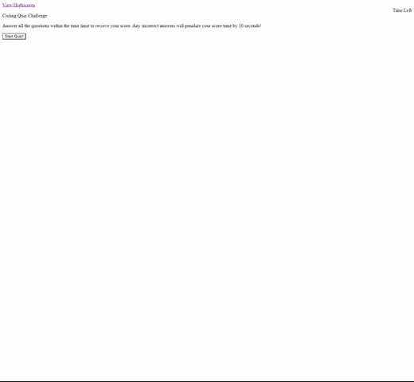

# Javascript-quiz

## **Description**

1. First I created an HTML with a basic structure for the page.

2. I next started a js document in which I compiled a majority of the code.

    1. I added questions with answers, a start button with an event listener, and some functions

    2. The first function i added was start quiz. this removed the intro info and start button, started a countdown timer, and displayed the first question.

    3. Then I created the nextQuestion function. This function used a for loop to cycle through all the questions and created an event listener for optionBtn clicks.

    4. Next up was my checkTrue function. It is set up to check if the user selection and the correct answer are a match. If they are correct then go to next question, and if they are incorrect it subtracts 10 seconds before moving to the next question. 

    5. Finally the function that gave me the most trouble was the showSubmission function. It is set up to stop displaying the quizBox and start displaying the submission form. On submit It takes you to a HighScores HTML that I created and should display the name. This is where I ran into trouble.

    6. Unfortunately I wasn't able to get the forms textContent to save to local storage, or show up in the highscores page.

3. I also Didn't get to style this page anywhere near as much as I'd like, but I work on Sundays and just ran out of time.

## **Screenshot**

## **Link to Page and Repository**

